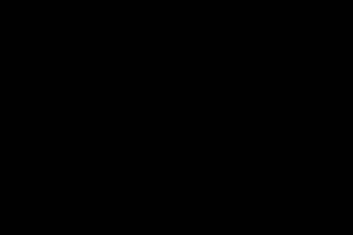

# EnGino
Personal Physics Engine.  
Current state:  


Currently there are two different implementations of position calculus.  
It still is a WIP, and will be for a long time.  

Features:    
* ObjectSpawners are configurable in spawn-rate, spawn position and spawned-object size.  
* Pressing the right mouse button on an object will focus the camera on it.
* Possibility to Render a simulation.  
* More to come.  

Thanks to [topongo](https://github.com/topongo), in order to Render a simulation it's only necessary to change the "render directory"
in *main.cpp* and in *script.py* and run the script with
```bash
python3 script.py 
```
in the project directory.


## Normal method
Movement is calculated with normal time law of motion.  
Collision response utilizes the correct equations, meaning that it simulates as good as possible the correct directions and modules of velocity of the objects colliding.  
Currently utilizes a restitution coefficient that simulates energy loss during collisions.  


## Verlet's integration
Using [Verlet's integration](https://en.wikipedia.org/wiki/Verlet_integration), the object's position and collision response is approximated, meaning that it's not "accurate" in terms of physics simulation but faster computational times.  


## Rendering
With the *Render* class it's possible to render each frame (framerate is modifiable) and save it in a user-specified directory.  
Then by using [ffmpeg](https://ffmpeg.org/) a video can be created from the frames rendered.

## TODO
- [ ] Calculate correct energy loss at collision.  
- [x] Implement [Sweep and Prune](https://en.wikipedia.org/wiki/Sweep_and_prune) algorithm for object collision detection.  
Now the engine is able to sustain stable 60-fps in real-time rendering up to 1000 objects (before 300 was the limit).   
- [ ] Add different object types and the respective object collision.  
- [ ] Implement total energy level.  
- [ ] Implement rotational objects and fixed objects.  
